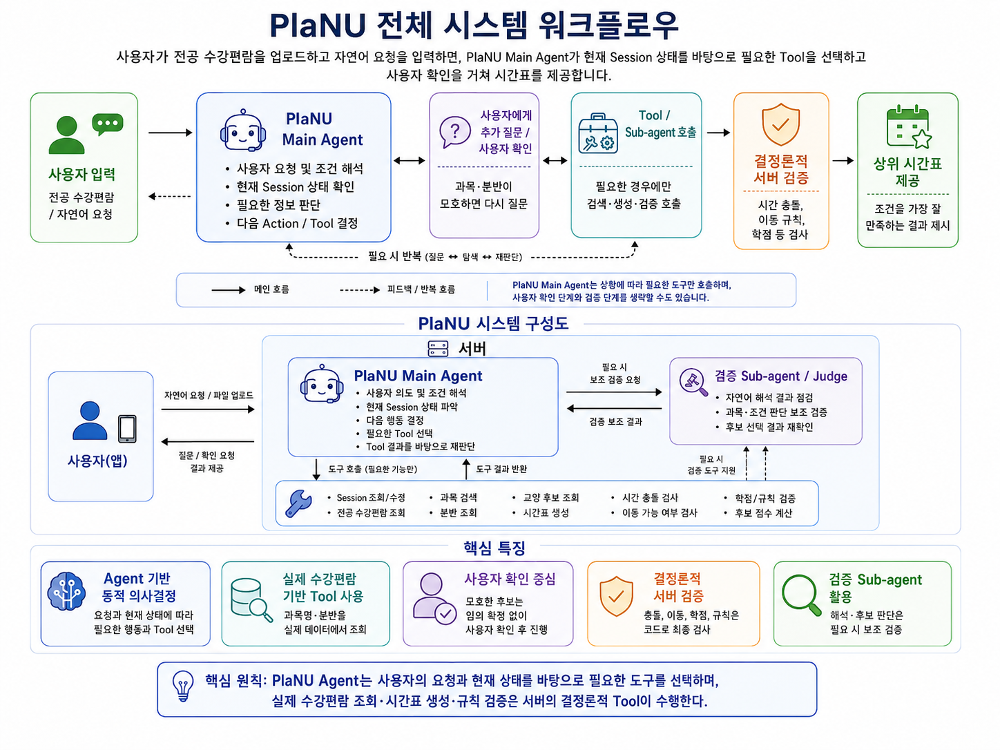

### 1. 프로젝트 소개

#### 1.1. 개발배경 및 필요성
> 편입생의 신분으로써, 부산대에 올해 입학하게 되었는데 과에서 안내가 지연되어 제대로 된 수강신청에 대한 안내를 뒤늦게 접하게 되었다.
> 확인을 하니 편입학의 최종결과가 나오기 이전 이미 희망과목에 대한 사전 수강신청(과목담기) 가 이미 종료된 상태였고, 부산대의 경우에는
> 단과대학교가 매우 많다보니 수강편람을 살펴봐도 과목수가 많아서 인식하는데 있어 어려움이 있었다. 특히 고전읽기와 토론, 인공지능과 컴퓨팅사고와 같은  
> 필수 교양의 경우 그 분반의 수만해도 50개가 넘어가며 시간표도 날짜별 정렬이 불가능하여 일일히 원하는 조건을 수강편람에서 찾아가야 하는 번거로움이 있었다. 
> 수강신청을 완료하고 , 개강을 한후 신입생에게 물어봤을때 대부분이 수강편람에 대한 가독성과 신청방법이 모호하다 보니 안내를 받아도 신청하는데 있어서 어려움 
> 이 많았고 몇몇 학우들은 원하는 과목을 놓쳐버려서 차선의 시간표를 구성하는데 시간과 노력을 많이 들였다고 답변하였다. 이처럼, 현 부산대 수강신청 프로세스에서
> 발견되는 문제점은 1) 방대한 수강과목으로 인한 가독성의 불편 , 2) 수강편람내 정렬기능의 부재로 원하는 정보를 찾아가는데 불편함 , 3) 일부 신/편입생의 경우 사전 시간표제
> 작에서 희망과목 수강담기가 불가능하므로 이상적 시간표의 구성이 어렵다 로 귀결될수 있었다.
> 아래는 24~26년도 부산대학교 편입학 합격자 수를 정리한 표이다. 표에서 볼 수 있듯이 몇백 명의 인원이 편입생의 신분으로 부산대학교에 들어오고, 여기에 추가 합격 신입생의 숫자도 더해지면, 적지 않은 수의 인원이 별다른 수강신청 안내 없이 혼자 수강신청을 진행해야 하는 상황에 놓이는 것이다.

|  연도   |  총 합격자 수  |
| :-----: | :----: |
| 2024학년도  | 336명 |
| 2025학년도 | 275명 |
| 2026학년도 | 203명 |


#### 1.2. 개발 목표 및 주요 내용

프로젝트의 목표 : 부산대 수강신청 도우미 프로그램(PlaNU) 개발을 통한 수강정정기간 민원 감소

주요 내용 : 사용자가 업로드한 수강편람과 자연어 요청을 바탕으로 **PlaNU Main Agent가 현재 Session 상태를 확인하고 필요한 Tool을 선택적으로 호출**하여, 사용자 확인을 거쳐 조건에 맞는 시간표를 제시


#### 1.3. 세부내용

> PlaNU는 사용자가 전공 수강편람과 원하는 시간표 조건을 입력하면, **PlaNU Main Agent가 사용자의 요청과 현재 Session 상태를 바탕으로 다음 행동을 판단하는 Agent 기반 수강신청 도우미**이다.
>
> Agent는 모든 사용자에게 정해진 단계를 똑같이 적용하지 않는다. 사용자가 과목과 분반을 명확하게 지정했다면 불필요한 검색을 생략할 수 있고, 정보가 부족하거나 모호한 경우에는 실제 수강편람을 조회하는 Tool을 사용하거나 사용자에게 추가 확인을 요청한다.
>
> 특히 과목·분반 후보가 여러 개이거나 Agent가 사용자의 의도를 하나로 확정하기 어려운 경우에는 **사용자에게 “이렇게 이해한 것이 맞는지” 확인받은 뒤 다음 단계로 진행**한다. 사용자가 수정하면 Agent는 새로운 정보를 반영해 다시 판단한다.
>
> 시간표 생성, 시간 충돌 검사, 강의실 이동 가능 여부, 학점 및 수강 규칙처럼 명확한 규칙으로 판단할 수 있는 작업은 LLM의 추측에 맡기지 않고 서버의 결정론적 Tool이 수행한다.
>
> 즉 PlaNU의 핵심은 **Agent가 관찰 → 판단 → 필요한 Tool 실행 또는 사용자 확인 → 결과 재검토**를 반복하면서 사용자의 의도를 점진적으로 확정하는 데 있다.


#### 1.4. 기존 서비스 대비 차별성

> 부산대 수강신청을 직접적으로 연습할수 있는 페이지는 총 2건 웹으로 되어있으나, 이것은 수강신청 자체를 연습하는데 그 목적이 있다.
> 따라서, 사용자가 사전에 시간표를 만들어보거나 수강편람을 익숙하게 다루고 원하는 조건대로 정렬할수 있도록 하는데는 거리가 멀고
> 각각 23년도와 24년도의 수강과목 및 교육과정을 포함하고 있어서 시간적 괴리가 존재하는 한계가 있다.
> PlaNU 의 경우에는, 개발자가 교양과목에 대한 수강편람을 주기적으로 갱신하고 사용자가 직접 최신의 전공 수강편람을 업로드 하는 방식이기 때문에
> 업데이트를 통해 시간적 괴리를 극복할수 있으며 수강편람을 일일히 정렬하거나 조건을 설정하는것 역시도 간편하게 할수 있으므로 사용자의 편리성을 보장한다.
> 또한, 앱을 통한 개발이므로 기존의 PC환경의 웹과는 차별화를 가지고 있으며 최근 증가하는 모바일 사용에 맞춰서 사용자의 간편함을 최대로 추구할수 있다.

#### 1.5. 사회적 가치 도입 계획

> 본 서비스는 학사 시스템에 익숙하지 않은 신입생·편입생의 수강신청 정보 비대칭을 해소한다. 복잡한 제약 조건을 인지하지 못해 발생하는 오신청을 줄임으로써, 개강 직후 정정 기간에 집중되는 민원을 감소시키고 행정 인력 낭비를 절감할 것으로 기대된다. 나아가 유사한 문제를 겪는 타 대학으로 서비스를 확장해 대학 전반의 수강신청 경험을 개선하는 범용 솔루션으로 발전시킬 수 있다.

### 2.상세설계

#### 2.1. 시스템 구성도

PlaNU는 사용자가 올린 전공 수강편람과 자연어 요청을 바탕으로 **Main Agent가 현재 Session을 읽고 필요한 Tool 또는 Sub-agent를 선택하는 구조**로 동작한다.

> 아래 내용은 현재 Agent 전환 방향을 기준으로 정리한 구조이다. 일부 Tool 또는 Validation Sub-agent는 구현 수준에 따라 동작 범위가 달라질 수 있다.

PlaNU의 중심은 고정된 `1 → 2 → 3 → ...` 파이프라인이 아니라 **PlaNU Main Agent의 반복적인 의사결정**이다.

```text
사용자
  │
  │ 전공 수강편람 / 자연어 요청
  ▼
PlaNU Main Agent
  │
  ├─ 사용자 의도와 조건 해석
  ├─ 현재 Session 상태 확인
  ├─ 필요한 정보가 충분한지 판단
  └─ 다음 Action / Tool 결정
  │
  ├──────────── 필요 시 ────────────┐
  ▼                                ▼
사용자에게 추가 확인            Tool / Sub-agent 호출
  │                                │
  └────────────→ Main Agent ←───────┘
                   │
             결과를 다시 확인
                   │
             필요하면 반복
                   ▼
             검증된 시간표 후보
                   │
                   ▼
             상위 시간표 제공
```

### PlaNU Main Agent의 역할

- 사용자의 자연어 요청에서 `Hard Constraint`와 `Soft Preference`를 파악
- 현재 `Session`에 어떤 정보가 이미 저장되어 있는지 확인
- 다음 단계에 필요한 정보가 충분한지 판단
- 필요한 Tool을 선택적으로 호출
- Tool 결과를 다시 확인하고 다음 행동을 결정
- 과목·분반 또는 조건이 모호하면 사용자에게 확인 요청
- 사용자의 확인이나 수정 결과를 Session에 반영한 뒤 다시 판단

### Main Agent가 활용하는 Tool

현재 구조에서 Tool은 Agent의 판단을 실제 데이터와 규칙으로 실행하는 역할을 한다.

- Session 정보 조회·수정
- 업로드된 전공 수강편람 조회
- 과목 검색
- 분반 조회
- 교양 후보 조회
- 시간표 생성
- 시간 충돌 검사
- 이동 가능 여부 검사
- 학점 및 수강 규칙 검증
- 시간표 후보 점수 계산

> 실제 구현에서는 repository의 Agent Tool과 Session 관련 코드를 기준으로 사용하며, 아직 구현되지 않은 기능을 구현 완료된 것처럼 간주하지 않는다.

### 사용자 확인과 Validation Sub-agent

Agent가 과목명, 분반, 사용자 조건을 하나로 확정하기 어려운 경우에는 **사용자 확인을 우선**한다.

예를 들어 사용자가 “컴퓨팅 사고 수업을 듣고 싶어요”라고 입력했는데 실제 수강편람에 비슷한 과목이 여러 개 있다면, Agent가 임의로 하나를 선택하지 않고 후보를 제시한 뒤 사용자의 확인을 받는다.

자연어 해석이나 후보 판단처럼 LLM이 실수할 가능성이 있는 부분은 필요할 경우 `Judge` 또는 `Validation Sub-agent`가 보조 검증할 수 있다. 다만 실제 과목의 존재 여부, 시간 충돌, 이동 규칙, 학점 제한 등 **결정론적으로 검사 가능한 항목은 서버 Tool이 최종 검증**한다.

<p align="center">
  
</p>

> 핵심 원칙: PlaNU Agent는 사용자의 요청과 현재 상태를 바탕으로 필요한 도구를 선택하고, 모호한 판단은 사용자에게 확인받으며, 실제 수강편람 조회·시간표 생성·규칙 검증은 서버의 결정론적 Tool이 수행한다.

<br/>


#### 2.3. 사용기술

|  이름   |  버전  |
| :-----: | :----: |
| Python  | 3.14.0 |
| Flutter | 3.41.0 |

PlaNU Main Agent와 Validation Sub-agent에 사용할 LLM API는 테스트 후 가장 적합한 모델을 선택할 예정
<br/>

### 3. 개발결과

#### 3.1. 전체 시스템 흐름

PlaNU는 하나의 `session_id`를 중심으로 사용자의 입력, 수강편람 분석 결과, 선택한 과목, 조건, 추천 결과를 이어서 관리한다.

사용자 입장에서의 큰 흐름은 `수강편람 업로드 → 요청 입력 → Agent와 상호작용 → 검증된 시간표 확인`으로 볼 수 있지만, Agent 내부에서는 정해진 순서를 한 번만 통과하는 것이 아니라 **현재 상태에 따라 다음 행동을 선택하고 필요한 경우 사용자와 반복적으로 확인**한다.

```text
전공 수강편람 업로드
        ↓
사용자 자연어 요청
        ↓
PlaNU Main Agent
        ↓
현재 Session + 사용자 요청 분석
        ↓
┌───────────────────────────────┐
│ 다음 행동 결정                │
│                               │
│ - 사용자에게 추가 질문        │
│ - 과목/분반 검색 Tool         │
│ - Session Tool                │
│ - 교양 후보 조회 Tool         │
│ - 시간표 생성 Tool            │
│ - 검증 Tool                   │
│ - 필요 시 Validation Sub-agent│
└──────────────┬────────────────┘
               │
         결과를 다시 확인
               │
       정보가 부족하면 반복
               │
               ▼
        검증된 시간표 후보
               ↓
         상위 결과 제공
```

##### 사용자 시나리오 예시 1: 요청이 명확한 경우

사용자가 정확한 과목명과 분반을 지정했다면 Agent는 불필요한 과목 검색이나 재질문을 줄이고, 실제 수강편람에 해당 과목·분반이 존재하는지 Tool로 확인한 뒤 다음 작업을 진행할 수 있다.

##### 사용자 시나리오 예시 2: 요청이 모호한 경우

사용자가 `컴퓨팅 사고 수업을 듣고 싶어요`처럼 실제 과목명과 다른 표현을 사용하면 Agent는 수강편람 검색 Tool을 사용해 후보를 찾는다.

후보가 여러 개라면 Agent는 하나를 임의로 확정하지 않고 사용자에게 다음과 같이 확인한다.

```text
'컴퓨팅사고와인공지능 001분반'과
'컴퓨팅사고와인공지능 002분반'을 찾았습니다.
어느 분반을 의미하셨나요?
```

사용자의 답변은 같은 `Session`에 반영되고, Main Agent는 새 정보를 바탕으로 다음 행동을 다시 판단한다.

##### Hard Constraint와 Soft Preference

Agent는 사용자 요청을 크게 다음 두 종류로 구분해 다룬다.

- **Hard Constraint**: 반드시 지켜야 하는 조건
- **Soft Preference**: 가능하면 반영할 선호 조건

예를 들어 `금요일은 반드시 공강`은 Hard Constraint로, `가능하면 오전 수업은 피하고 싶다`는 Soft Preference로 해석할 수 있다.

다만 Agent의 자연어 해석만으로 최종 시간표를 확정하지 않는다. 실제 시간표 생성 과정에서는 서버 Tool이 다음 항목을 코드로 검사한다.

- 실제 과목 및 분반 존재 여부
- 같은 시간의 수업 충돌
- 강의실 이동 가능 여부
- 연속 수업 조건
- 총 신청 학점
- 필수 공강일과 시작·종료 시간 조건
- 기타 수강 규칙

검사를 통과한 후보만 남긴 뒤 조건 만족도를 계산하고 상위 시간표를 사용자에게 보여준다.

사용자는 결과를 확인한 뒤 조건을 수정할 수 있으며, Main Agent는 변경된 정보를 반영해 필요한 Tool만 다시 호출한다.

<br/>


#### 3.2. 기능 설명

##### `1. 전공 수강편람 업로드`

사용자가 자신의 학과 전공 수강편람 엑셀 파일을 올리는 기능이다.

- `.xlsx` 파일을 우선 사용한다.
- 학과와 파일 형식을 확인한다.
- 과목명, 과목 코드, 분반, 시간, 강의실, 학점을 읽는다.
- 파일을 읽지 못하면 오류 이유와 다시 시도하는 방법을 보여준다.
- 업로드가 끝나면 같은 `session_id`를 이후 Agent 상호작용에서도 계속 사용한다.

##### `2. 자연어 조건 입력 및 Agent 해석`

사용자가 원하는 시간표 조건을 자연어로 입력하는 기능이다.

입력 예시:

```text
금요일은 반드시 공강으로 만들어 주세요.
오전 10시 이전 수업은 피하고 싶어요.
컴퓨터프로그래밍은 꼭 듣고 싶어요.
가능하면 수업이 한쪽 요일에 모였으면 좋겠어요.
```

PlaNU Main Agent는 현재 Session과 함께 이 요청을 확인하고 다음 정보를 파악한다.

- 반드시 지켜야 하는 `Hard Constraint`
- 가능하면 반영할 `Soft Preference`
- 필수로 듣고 싶은 과목
- 제외하고 싶은 과목
- 추가 검색이나 사용자 확인이 필요한 표현

Agent는 한 번의 해석만으로 모든 내용을 확정하지 않는다. 해석이 모호하거나 실제 수강편람과 연결하기 어려운 표현이 있으면 Tool을 호출하거나 사용자에게 다시 질문한다.

##### `3. 과목·분반 검색 Tool`

사용자가 입력한 과목명이나 조건에 맞는 과목을 실제 수강편람에서 찾는 기능이다.

- 특정 과목 이름 검색
- 과목 코드 검색
- 교양 영역별 검색
- 요일·시간 조건 검색
- 한 과목의 분반 목록 확인
- 특정 분반의 상세 정보 확인

과목명이 정확하지 않아도 실제 수강편람에서 비슷한 후보를 찾을 수 있다.

다만 후보가 여러 개이면 Agent가 첫 번째 후보를 자동으로 고르지 않는다. **사용자에게 후보를 보여주고 어떤 과목 또는 분반을 의미했는지 확인받은 뒤 Session에 반영한다.**

##### `4. 사용자 확인 및 전공 과목·분반 확정`

과목·분반에 대한 최종 의미가 모호한 경우 사용자가 직접 확인하는 단계이다.

- Agent가 이해한 과목과 분반을 사용자에게 제시
- 사용자가 Agent의 이해가 맞는지 확인
- 잘못 이해했다면 사용자가 수정
- 여러 후보가 있다면 사용자가 직접 선택
- 사용자가 확인한 선택만 Session에 저장
- 수정 결과를 바탕으로 Main Agent가 다음 행동을 다시 판단

PlaNU는 사용자의 의도가 불명확한 상태에서 과목이나 분반을 임의로 확정하지 않는 것을 원칙으로 한다.

##### `5. 교양 후보 준비`

Main Agent는 사용자의 조건과 현재 Session 상태를 확인한 뒤 필요한 경우 교양 후보 조회 Tool을 사용한다.

- Hard Constraint를 우선 적용
- Soft Preference는 후보 순위 계산에 활용
- 실제 수강편람 또는 서버가 제공하는 데이터에 존재하는 과목만 후보로 사용
- 현재 자료로 확인하기 어려운 조건은 따로 안내

현재 수강편람 정보만으로 판단하기 어려운 예시는 다음과 같다.

- 과제가 적은 수업
- 시험이 없는 수업
- 학점을 받기 쉬운 수업
- 교수 평가가 좋은 수업
- 재미있는 수업

이런 내용은 임의로 추측하지 않고 현재 데이터로 판단할 수 없음을 사용자에게 알린다.

##### `6. Main Agent의 반복 판단과 Validation Sub-agent`

PlaNU의 핵심은 두 LLM을 고정 순서로 한 번씩 호출하는 것이 아니라, **Main Agent가 Session과 Tool 결과를 확인하면서 다음 행동을 반복적으로 결정하는 것**이다.

Main Agent는 다음 역할을 담당한다.

- 사용자 의도 및 조건 해석
- 현재 Session 상태 확인
- 필요한 정보 판단
- 사용할 Tool 선택
- Tool 결과 확인
- 사용자 확인 필요 여부 판단
- 수정된 사용자 응답을 반영하여 다음 행동 결정

자연어 해석이나 후보 판단처럼 LLM이 실수할 수 있는 영역에는 필요에 따라 `Judge` 또는 `Validation Sub-agent`를 보조적으로 활용할 수 있다.

검증 대상의 예시는 다음과 같다.

- Agent가 이해한 과목이 사용자의 표현과 의미상 맞는지
- Hard Constraint와 Soft Preference가 잘못 뒤바뀌지 않았는지
- 여러 후보 중 하나를 근거 없이 선택하려 하지 않았는지
- 자연어 해석에서 중요한 조건이 누락되지 않았는지

다만 다음과 같은 항목은 Validation Sub-agent의 판단에 맡기지 않는다.

- 실제 과목 존재 여부
- 실제 분반 존재 여부
- 시간 충돌
- 강의실 이동 가능 여부
- 학점 제한
- 명확한 수강 규칙

이러한 항목은 서버의 결정론적 Tool이 최종 검증한다.

##### `7. 시간표 생성 Tool`

사용자가 확인한 전공 과목과 준비된 교양 후보를 조합하여 시간표 후보를 만드는 기능이다.

시간표를 만들 때 서버가 다음 내용을 확인한다.

- 수업 시간 겹침
- 강의실 이동 거리
- 수업 사이 이동 가능 시간
- 연속 수업 여부
- 총 신청 학점
- 필수 공강 요일
- 가장 빠른 수업 시작 시간
- 가장 늦은 수업 종료 시간
- 필수 과목 포함 여부
- 제외 과목 포함 여부

하나라도 반드시 지켜야 하는 Hard Constraint를 어긴 시간표는 제외한다.

##### `8. 결정론적 검증 및 순위 계산`

충돌과 규칙 검사를 통과한 시간표를 대상으로 점수를 계산한다.

예를 들어 다음 요소를 사용할 수 있다.

- 사용자가 원하는 공강일을 만들었는가
- 아침 수업을 줄였는가
- 수업이 여러 날로 지나치게 흩어지지 않았는가
- 목표 학점에 가까운가
- 강의실 이동이 무리하지 않은가
- 선호 과목을 포함했는가

Hard Constraint는 통과 여부를 판단하고, Soft Preference는 시간표 사이의 순위를 정하는 데 사용한다.

##### `9. 추천 결과 제공`

점수가 높은 시간표를 사용자에게 순서대로 보여주는 기능이다.

각 결과에는 다음 내용을 표시한다.

- 순위
- 주간 시간표
- 과목과 분반
- 총 학점
- 공강 요일
- 시작·종료 시간
- 조건별 충족 여부
- 추천 이유
- 경고 또는 반영하지 못한 조건

사용자는 결과를 확인한 뒤 조건을 수정할 수 있다. 조건이 바뀌면 Main Agent는 변경된 Session을 기준으로 필요한 작업만 다시 수행한다.

##### `10. 오류 안내 및 다시 시도`

문제가 발생했을 때 단순히 실패했다고만 표시하지 않고, 사용자가 다음에 무엇을 해야 하는지 안내한다.

주요 오류 예시는 다음과 같다.

- 수강편람 파일 형식이 잘못됨
- 수강편람에서 필요한 정보를 찾지 못함
- Session이 만료됨
- 사용자 확인이 아직 필요한 과목·분반이 남아 있음
- 조건을 만족하는 시간표가 없음
- 서버, Tool 또는 LLM 연결 실패

오류가 발생해도 가능한 입력과 선택값은 유지하고, Main Agent가 문제가 된 상태부터 다시 판단할 수 있도록 구성한다.

<br/>

#### 3.3. 기능명세서

PlaNU의 주요 기능은 **사용자 입력 → Main Agent 판단 → 필요한 Tool 실행 → 사용자 확인 또는 서버 검증 → 결과 제공**의 구조를 기준으로 구성된다.  
모든 기능이 고정된 순서로 실행되는 것은 아니며, Main Agent가 현재 `Session` 상태와 사용자 요청을 바탕으로 필요한 기능을 선택적으로 사용한다.

| 라벨 | 기능 | 상세 |
| :--: | :-- | :-- |
| A1 | 전공 수강편람 업로드 | 사용자가 `.xlsx` 형식의 전공 수강편람을 업로드한다. 서버는 파일 형식과 내용을 검증하고 정상 처리된 과목 정보를 같은 `session_id`에 저장한다. |
| A2 | Session 상태 관리 | 업로드 결과, 사용자 조건, 선택 과목, 후보 시간표 등 현재 진행 상태를 Session 단위로 조회·수정한다. 이전 단계의 정보가 바뀌면 관련된 후속 결과를 필요한 범위에서 다시 계산한다. |
| A3 | 자연어 요청 해석 | Main Agent가 사용자의 요청에서 반드시 지켜야 할 `Hard Constraint`, 가능하면 반영할 `Soft Preference`, 원하는 과목, 제외 과목, 추가 확인이 필요한 표현을 파악한다. |
| A4 | 과목·분반 검색 Tool | 사용자의 표현을 실제 수강편람 데이터와 대조해 과목명, 과목 코드, 분반, 요일·시간 등의 후보를 조회한다. 실제 데이터에 없는 과목을 LLM의 추측으로 생성하지 않는다. |
| A5 | 사용자 확인 및 수정 | 과목·분반이나 조건이 모호하면 Agent가 자신이 이해한 내용과 후보를 사용자에게 보여주고 확인을 요청한다. 사용자가 수정하면 그 내용을 Session에 반영하고 다시 판단한다. |
| A6 | 전공 과목·분반 확정 | 후보가 여러 개일 때 Agent가 임의로 하나를 고르지 않고, 사용자가 확인한 과목과 분반만 최종 선택값으로 저장한다. |
| A7 | 교양 후보 준비 | 확정된 전공 과목과 사용자 조건을 바탕으로 실제 교양 데이터에서 가능한 후보를 준비한다. Hard Constraint는 필터링에, Soft Preference는 후보 평가에 활용한다. |
| A8 | Validation Sub-agent / Judge | 자연어 해석이나 후보 연결 등 LLM 판단이 필요한 부분을 필요할 때 보조 검증한다. 실제 과목 존재 여부, 시간 충돌, 학점과 같은 결정론적 검사는 서버 Tool이 담당한다. |
| A9 | 시간표 생성 Tool | 확정된 전공 과목과 교양 후보를 조합해 시간표 후보를 생성한다. |
| A10 | 결정론적 서버 검증 | 생성된 후보에 대해 시간 충돌, 강의실 이동 가능 여부, 연속 수업, 총 학점, 필수 공강일, 시작·종료 시간 등의 규칙을 코드로 검사한다. |
| A11 | 후보 점수 계산 및 추천 | 검증을 통과한 시간표에 대해 Soft Preference 반영 정도를 계산하고 상위 후보를 사용자에게 보여준다. |
| A12 | 오류 안내 및 재시도 | 파일 오류, Session 만료, 후보 없음, 서버·Tool·LLM 연결 실패 등을 구분해 안내하고 가능한 입력과 선택값을 유지한 채 해당 단계부터 다시 시도할 수 있도록 한다. |

> **사용자 확인 원칙:** PlaNU Main Agent가 사용자의 의도나 과목·분반을 확실하게 판단할 수 없는 경우 임의로 확정하지 않는다. 현재 이해한 내용을 사용자에게 먼저 확인받고, 확인 또는 수정 결과를 반영한 뒤 다음 행동을 결정한다.

<br/>

#### 3.4. 디렉토리 구조

PlaNU는 **Flutter 프론트엔드, FastAPI 백엔드, Session 기반 Main Agent와 Agent Tool**로 구성된다.  
아래는 현재 프로젝트의 핵심 디렉토리를 역할 중심으로 정리한 구조이다.

```text
pnuai-a-01-planu/
├── README.md
├── docs/
│   └── images/                         # README 및 발표용 이미지
│       └── planu_workflow_judges.png
│
├── frontend/                           # Flutter 모바일 앱
│   ├── lib/
│   │   ├── main.dart                   # 앱 진입점 및 전체 화면 흐름 연결
│   │   ├── models/                     # 앱 상태 및 API 요청·응답 모델
│   │   ├── repositories/               # 화면과 API Client 사이의 데이터 계층
│   │   ├── services/                   # FastAPI 백엔드와 통신하는 API Client
│   │   ├── state/                      # 사용자 진행 상태 및 화면 흐름 관리
│   │   └── screens/                    # 안내, 업로드, 전공 선택, 조건 입력, 결과 화면
│   ├── test/                           # Flutter widget / flow 테스트
│   ├── android/                        # Android 실행 설정
│   └── pubspec.yaml                    # Flutter 패키지 및 asset 설정
│
├── backend/                            # Python + FastAPI 서버
│   ├── app/
│   │   ├── main.py                     # FastAPI 앱 진입점
│   │   ├── routes/                     # HTTP API endpoint
│   │   ├── models/                     # Session, 과목, 사용자 조건 등 데이터 모델
│   │   ├── repositories/               # Session / 수강편람 저장소 계층
│   │   ├── services/                   # 과목 탐색, Session 처리, 시간표 생성·검증 로직
│   │   ├── agent_tools/                # Main Agent가 호출하는 Tool 모듈
│   │   │   ├── course_discovery_tools.py
│   │   │   ├── session_agent_tools.py
│   │   │   ├── session_command_tools.py
│   │   │   └── session_query_tools.py
│   │   └── agents/
│   │       ├── session_state_agent.py  # Session 상태를 기준으로 다음 행동을 판단하는 Main Agent
│   │       ├── simple_session_model.py # Agent 실행을 지원하는 모델
│   │       └── prompts/                 # Agent system prompt
│   └── tests/                           # Agent, Tool, Session, API, 시간표 생성 관련 테스트
│
└── .gitignore
```

각 영역의 역할은 다음과 같다.

- **Frontend**: 사용자의 파일 업로드, 자연어 입력, 후보 확인·수정, 결과 표시를 담당한다.
- **Main Agent**: 현재 `Session`과 사용자 요청을 파악하고 다음 행동을 결정하며 필요한 Tool을 선택한다.
- **Agent Tool**: Session 조회·수정, 실제 수강편람 검색, 과목·분반 조회 등 Agent가 판단한 작업을 수행한다.
- **Validation Sub-agent / Judge**: 자연어 해석이나 후보 판단처럼 LLM의 보조 검증이 필요한 경우에만 사용한다.
- **Server Service / Repository**: 시간표 생성, 실제 데이터 조회, 시간 충돌·이동·학점 등 결정론적 규칙 검증을 담당한다.

> PlaNU에서 **Agent는 판단과 오케스트레이션을 담당하고, 실제 데이터 조회·Session 변경·시간표 생성·규칙 검증은 Tool과 서버 코드가 담당한다.**

<br/>

### 4. 설치 및 사용 방법

**필요 패키지**

- 위의 사용 기술 참고

```bash
$ git clone https://github.com/test/test.git
$ cd test/frontend
$ npm i
$ export NODE_ENV="development" # windows: set NODE_ENV=development
$ npm run build:dll
$ export TARGET="http://localhost:8000"  # windows: set NODE_ENV=http://localhost:8000
$ npm run dev
```

<br/>

#### 4.1. PlaNU 백엔드 API 흐름

아래 API 목록은 현재 프론트엔드와 서버 사이의 **세션 기반 API 계약**을 설명한다. 이는 Agent가 항상 모든 API를 고정 순서로 호출한다는 의미가 아니라, 현재 Session 상태와 필요한 작업에 따라 Main Agent 또는 프론트엔드 흐름에서 관련 기능을 사용하기 위한 인터페이스이다. 같은 사용자 흐름에서는 하나의 `session_id`를 이어서 사용하며, 세션이 만료되어 `SESSION_NOT_FOUND`가 반환되면 전공 수강편람 업로드부터 다시 시작해야 한다.

1. `GET /health`
   - 서버 상태 확인용이다.
   - 성공 응답 예: `{"status":"ok"}`

2. `POST /catalog/major`
   - Content-Type: `multipart/form-data`
   - 필수 필드: `department`, `major_catalog` (`.xlsx`)
   - 다음 단계에서 `session_id`를 재사용한다.
   - 주요 성공 필드: `session_id`, `session_stage="catalog_parsed"`, `parsed_course_count`, `warnings`

3. `POST /major/preview`
   - Content-Type: `application/json`
   - 필수 필드: `session_id`, `prompt`
   - 다음 단계에서 `preview_id`를 재사용한다.
   - `can_confirm=false`이면 `/major/confirm`을 호출하지 말고 사용자가 프롬프트를 수정해야 한다.

4. `POST /major/confirm`
   - Content-Type: `application/json`
   - 필수 필드: `session_id`, `preview_id`
   - 성공 시 세션 단계는 `major_confirmed`이다.

5. `POST /general/prepare`
   - Content-Type: `multipart/form-data`
   - 필수 필드: `session_id`, `elective_area`
   - 선택 필드: `elective_catalog` (`.xlsx`). 파일이 없으면 서버 fallback 교양선택 데이터를 사용한다.
   - 성공 시 세션 단계는 `general_ready`이다.

6. `POST /recommend/generate`
   - Content-Type: `application/json`
   - 필수 필드: `session_id`
   - 선택 필드: `target_total_credits`, `additional_elective_count`, `hard_conditions`, `preference_prompt`, `max_candidates`
   - 프롬프트나 학점 목표가 바뀌면 이 단계부터 다시 호출한다.
   - 성공 시 세션 단계는 `candidates_generated`이고, `unsupported_conditions`, `warnings`, `truncated`, `diagnostics`를 함께 확인한다.

7. `POST /recommend/rank`
   - Content-Type: `application/json`
   - 필수 필드: `session_id`
   - 선택 필드: `template` (`balanced`, `free_day_priority`, `no_morning_priority`, `compact_schedule`), `top_n`
   - 템플릿만 바뀌면 `/recommend/generate`를 다시 호출하지 않고 이 API만 다시 호출한다.
   - 성공 시 세션 단계는 `ranking_completed`이며, `ranked_candidates`의 각 항목은 `rank`, `raw_score`, `score_components`, `load_satisfaction`을 포함한다.

대표 오류 응답 형식:

```json
{
  "error": {
    "code": "INVALID_SESSION_STAGE",
    "message": "전공 확정과 교양 후보 준비가 완료된 세션에서만 시간표를 생성할 수 있습니다.",
    "hint": null,
    "details": {}
  }
}
```

주요 오류 코드: `MAJOR_CATALOG_REQUIRED`, `INVALID_FILE_EXTENSION`, `INVALID_EXCEL_FILE`, `FILE_TOO_LARGE`, `SESSION_NOT_FOUND`, `INVALID_SESSION_STAGE`, `MAJOR_PREVIEW_NOT_CONFIRMABLE`, `INVALID_ELECTIVE_AREA`, `UNKNOWN_RANKING_TEMPLATE`, `INVALID_TOP_N`.

테스트 실행:

```bash
cd C:\hackerton
python -m pytest backend\tests -v
python -m pytest backend\tests\integration -v
python -m pytest backend\tests -m "not llm_live" -v
python -m pytest backend\tests -m llm_live -v
```

실제 LLM 파서 테스트는 비용과 네트워크 상태의 영향을 받으므로 기본 테스트에서 제외된다. 운영 경로와 같은 LLM/proxy를 호출하려면 명시적으로 환경 변수를 설정한 뒤 `live_llm` marker만 실행한다. 인증값은 로그에 출력하지 않으며, trace에는 모델명, proxy 사용 여부, case 이름, latency, 성공/실패 요약만 남깁니다.

```bash
cd C:\hackerton
set RUN_LIVE_LLM_TESTS=1
set PROXY_TOKEN=...
set OPENAI_MODEL=openai/gpt-4.1-mini
set CHAT_PROXY_URL=https://mlapi.run/.../v1
python -m pytest backend\tests\live_llm -m live_llm -v -s
```

PowerShell을 쓰는 경우:

```powershell
cd C:\hackerton
$env:RUN_LIVE_LLM_TESTS = "1"
$env:PROXY_TOKEN = "..."
$env:OPENAI_MODEL = "openai/gpt-4.1-mini"
$env:CHAT_PROXY_URL = "https://mlapi.run/.../v1"
python -m pytest backend\tests\live_llm -m live_llm -v -s
```

특정 parser만 실행:

```bash
python -m pytest backend\tests\live_llm\test_major_selection_live.py -m live_llm -v -s
python -m pytest backend\tests\live_llm\test_general_preference_live.py -m live_llm -v -s
python -m pytest backend\tests\live_llm\test_live_llm_smoke.py -m live_llm -v -s
```

`RUN_LIVE_LLM_TESTS=1`이 없거나 `PROXY_TOKEN`이 설정되지 않은 경우 실제 호출 없이 skip된다. timeout은 기본 60초이며 필요하면 `LIVE_LLM_TIMEOUT_SECONDS`로 조정할 수 있다.

<br/>

### 5. 소개 및 시연영상

[]([(https://youtu.be/Yo1ln3_Yogs?si=3zfgLI3WK5Ac6fCl)])

<br/>

### 6. 팀 소개

|                                                                   이학영                                                                    |                                                                   김승주                                                                    |                                                                   김예솔                                                                    |
| :------------------------------------------------------------------------------------------------------------------------------------------: | :------------------------------------------------------------------------------------------------------------------------------------------: | :------------------------------------------------------------------------------------------------------------------------------------------: |
|  |  |  |
|                                                             lhy1170@pusan.ac.kr                                                              |                                                              rlatmdwn0717@naver.com                                                              |                                                              kimyesole@naver.com                                                               |
|                                                               백엔드 개발, 시스템 프롬프트 수정을 위한 스킬 작성                                                                |                                                        프론트엔드 개발 및 팀장보조                                                          |                                                          프론트엔드 개발 및 보조                                                           |

<br/>

### 7. 해커톤 참여 후기

- 이학영
  > LLM을 활용해야 할 문제, 활용할 필요 없는 문제에 대해 고민해볼 수 있는 기회가 되었고, 그러기 위해선 유저 페르소나 설정이 매우 중요하다는 것을 느끼게 되었다.
- 김승주
  > 코딩관련 지식이 전무하다 보니, 전반적으로 적응하는데 오랜 시간이 걸렸다. 다만, 문제상황에 대해 실질적인 해결안까지를 직접 설계하고 개발하는 것에 있어서 문제해결능력을 기를수 있었고 새로운 분야에 대해 도전하고 이해하는 과정속에서 다른 학우들과 호흡을 맞추는 그 과정자체가 즐거웠고 흥미로웠다. 
- 김예솔
  >  이번에 함께한 PlaNU 팀원들을 통해 해당 공모전에 참여하게 되었습니다. 이전까지 AI를 제대로 다뤄본 적이 없고, 프로그램 같은 것을 다뤄본 경험은 대학교 필수 과목에서 잠깐 스쳐 간 것이 전부였습니다. 더하여 전공 역시 거리가 먼 인문계열이기 때문에, 활동을 잘 진행할 수 있을지에 대한 고민을 안고 시작하였습니다. 하지만 두 팀원의 도움으로 하나씩 과정을 실행하고 만들어가면서 팀 프로젝트를 진행해 나가다 보니, 어느새 완성에까지 다다르게 되었습니다. 이번 활동은 평소에는 접할 일이 없고, 혼자라면 할 수 없었을 AI를 활용한 앱 제작이라는 프로젝트에 참여하여 완성에 함께하였다는 점, 또한 능력 있는 팀원들과 합을 맞출 기회가 되었다는 점에서 개인적으로 의미가 큰 활동이었습니다.
  > <br/>
